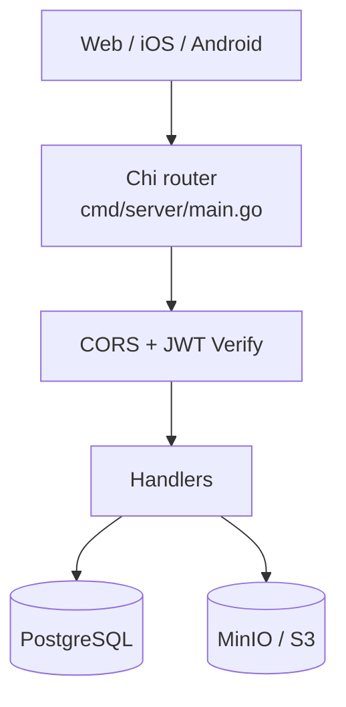

# Backend Architecture & Conventions

## Architecture



### Layers

| Layer | Package | Role |
|-------|---------|------|
| Entrypoint | `cmd/server` | Config, DB, S3, route wiring, graceful shutdown |
| Handlers | `internal/handler` | HTTP + SQL (no separate repository layer) |
| Middleware | `internal/middleware` | CORS, JWT issue/verify |
| Models | `internal/model` | Request/response DTOs and domain structs |
| Database | `internal/database` | pgx pool + embedded migrations |
| Storage | `internal/storage` | S3/MinIO client |
| Config | `internal/config` | Env loading |

Startup: load env → connect Postgres (retry) → migrate → S3 client → Chi routes → serve.

There is **no** ORM and **no** service layer. Handlers own transactions and SQL.

## Package layout

```
cmd/
  server/main.go      # routes live here
  devtoken/main.go    # mint JWTs for local testing
internal/
  config/
  database/migrations/
  handler/            # auth, beer, review, feed, photo + helpers
  middleware/
  model/
  storage/
```

## Data model

```
users 1──* reviews *──1 beers
reviews 1──* review_photos  →  S3 object (storage_key)
```

- **Beers** are global. Indexed on `lower(name), lower(brewery)`.
- **Reviews** are owned by `user_id`. Cascade on user/beer delete.
- **Photos** store `storage_key` + `sort_order`; served via `GET /api/photos/{key}`.

## Domain rules

### Find-or-create beer

On `POST /api/reviews` with an inline `beer` object:

1. Look up by case-insensitive `name` + `brewery`.
2. If found → reuse ID (do **not** update style/ABV).
3. If missing → insert with request style/ABV and `created_by`.

`POST /api/beers/` always inserts (no dedup). Prefer review create + find-or-create for clients.

### Published vs private

Published (feeds + beer public pages):

```sql
(r.rating > 0 OR btrim(coalesce(r.review_text, '')) <> '')
```

Private journal: owner’s `GET /api/reviews` includes log-only pours.

### Aggregates

```sql
avg(r.rating) FILTER (WHERE r.rating > 0)
count(r.id) FILTER (WHERE r.rating > 0)
```

### Review update

Editable: `rating`, `review_text`, `tasted_at`, `photo_keys`.  
Ignored: nested `beer` (catalog is master data).  
Rating range: **0–5**.

### Admin catalog

`users.is_admin` gates `/api/admin/*`. Grant via `ADMIN_EMAILS` (on sign-in/`/me`) or SQL.

| Endpoint | Behavior |
|----------|----------|
| `PATCH /api/admin/beers/{id}` | Edit name/brewery/style/abv |
| `GET /api/admin/beers/duplicates` | Groups with identical lower(name)+lower(brewery) |
| `POST /api/admin/beers/merge` | Reassign reviews to `keep_id`, delete `merge_ids` |
| `POST /api/admin/beers/dedupe-exact` | Auto-merge each exact group (keep most rated reviews, then oldest) |

Exact-match creation reuse lives in `findOrCreateBeer` (review create + `POST /api/beers`). Fuzzy/typo merges stay manual for now.

Shared SQL lives in `internal/handler/beer_helpers.go` (`publishedReviewSQL`, `beerAggregateSelect`, `findOrCreateBeer`, `attachBeerAndPhotos`).

## API map

### Public

| Method | Path | Notes |
|--------|------|-------|
| GET | `/healthz` | Liveness |
| GET | `/api/public/feed` | Published reviews |
| GET | `/api/public/feed/beer/{beerId}` | Published for beer |
| GET | `/api/public/beers` | Catalog (`?q=`) |
| GET | `/api/public/beers/{id}` | Beer + aggregates |
| GET | `/api/photos/{key}` | Photo bytes (public; UUID keys) |

### Auth

| Method | Path | Auth |
|--------|------|------|
| POST | `/api/auth/google` | — |
| POST | `/api/auth/apple` | — |
| POST | `/api/auth/refresh` | — |
| GET | `/api/auth/me` | Bearer |
| PATCH | `/api/auth/me` | Bearer |

### Authenticated

| Method | Path | Notes |
|--------|------|-------|
| GET/POST | `/api/beers/` | Catalog |
| GET | `/api/beers/{id}` | |
| GET | `/api/reviews/` | **Own** journal (all pours) |
| GET/PUT/DELETE | `/api/reviews/{id}` | Own only |
| POST | `/api/reviews/` | Create pour |
| GET | `/api/feed/` | Published |
| GET | `/api/feed/beer/{beerId}` | Published |
| GET | `/api/feed/user/{userId}` | Published for user |
| POST | `/api/photos/upload` | Multipart `photo`, max 10MB |

Query params: `page`, `per_page` (max 100), feed `sort=created_at|tasted_at`, beer `q`.

Errors: `{"error":"message"}`. Success pagination: `{ data, total_count, page, per_page }`.

## Code conventions

### Naming

- Packages: short nouns (`handler`, `model`, `middleware`).
- Handlers: `{Domain}Handler`, constructors `New{Domain}(...)`.
- Methods: HTTP-shaped — `List`, `Get`, `Create`, `Update`, `Delete`.
- JSON: **snake_case** (`beer_id`, `review_text`, `tasted_at`).
- Sensitive fields: `json:"-"`.

### Style

- Prefer clear raw SQL over abstractions.
- Use transactions when creating/updating review + photos (+ beer find-or-create).
- Keep handler error messages generic for 500s (no internal detail to clients).
- Shared fragments go in `*_helpers.go` / `*_shared.go`, not copied across handlers.
- Unit-test pure helpers and middleware; handler DB tests are not required yet but welcome.

### Do / don’t

| Do | Don’t |
|----|-------|
| Reuse beers via `beer_id` or find-or-create | Mutate shared beers from review updates |
| Filter public surfaces with `publishedReviewSQL` | Put log-only pours on public feeds |
| Attach nested `beer` + `photos` on create/update responses | Return bare review IDs when clients need catalog linkage |
| Validate rating 0–5 | Treat 0 as “invalid” |

## Local development

See [README.md](../README.md) for Compose ports and env table.

Key env vars: `DATABASE_URL`, `JWT_SECRET`, `GOOGLE_CLIENT_IDS`, `CORS_ALLOWED_ORIGINS`, `S3_*`.

`APP_ENV=production` refuses the default JWT secret.

## Testing

```bash
go test ./...
```

Current coverage is unit-level (config, JWT, CORS, pagination helpers). No DB integration suite yet.

## Key files

| File | Role |
|------|------|
| `cmd/server/main.go` | All routes |
| `internal/handler/beer_helpers.go` | Domain SQL rules |
| `internal/handler/review.go` | Pour CRUD |
| `internal/handler/feed.go` | Public/auth feeds |
| `internal/database/migrations/001_initial.up.sql` | Schema |
| `internal/model/review.go` | Review DTOs |
